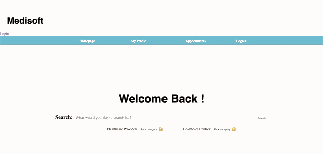
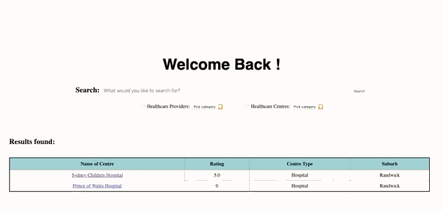

# MediSoft
                                                   

An online healthcare appointment management system (HAMS) that would streamline the process of patients booking healthcare appointments and general practitioners sending referrals to specialists. This was created in a team and I implemented the backend and frontend for the booking algorithm and history of patients and appointments. 
This project was designed using object-oriented design principles and implemented using **Python, Flask,Pickle for database, Jinja2, CSS and HTML. Agile Development** was tested through adapting the website to changes in specifications after the first iteration. 

Patients are able to search for healthcare services and providers to book appointments, view their profiles, provide ratings and view their appointment history with reference to notes and prescriptions the doctor makes. Care must be taken to ensure appointments are valid. 

Healthcare Providers are able to view appointment history, upcoming appointments, patient history and start consultation (allowing them to write notes and prescribe medicine during the consultation). 

Both users must log in before viewing information.

## Instructions 
1. Download the Repository
2. Open the terminal and switch to the repository
3. Run the command python3 run.py and open the link in the browser
